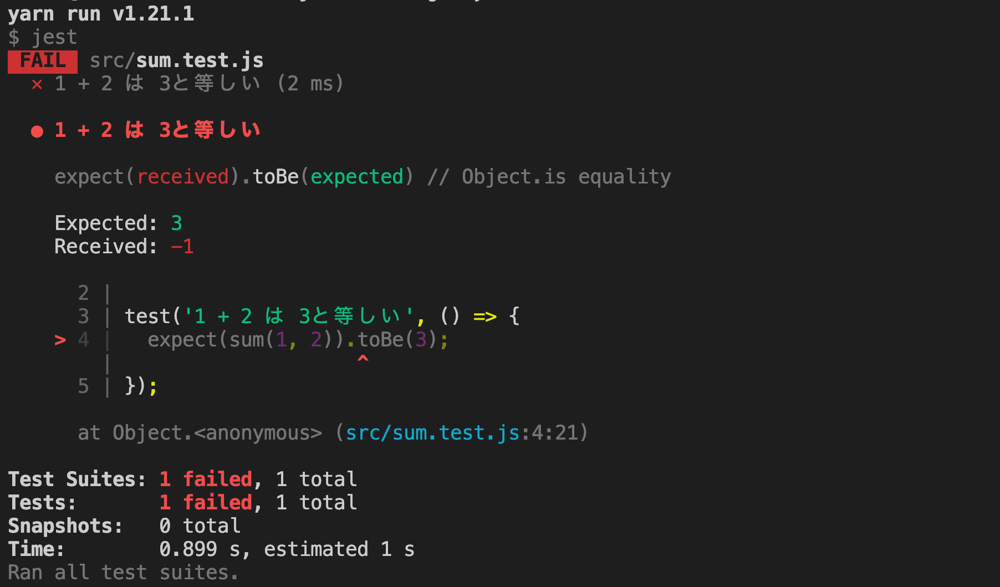

# テスト駆動開発環境のセットアップ


このレッスンではJestを使ったテストと、テスト駆動開発を学びます。

## テストとは

プログラミングにおけるテストとは、どういうものでしょうか？

それを理解するために、テストがどういうときにプログラミングでは必要になるかを説明します。

大きなプロジェクトほど、1つコードに変更を行うと、他の部分にも影響が出たり、チームメンバーが書いたコードを、パフォーマンス改善や可読性の向上のために書き直したい、と思うことがあります。

そうなると、書き直したコードがちゃんと機能するかチェックしたり、他に影響が出そうな部分も今まで通り動くかチェックしたりする必要がありますね。

しかし、上記を全て手動でチェックしようとすると、編集する度に手動で作業を行う必要があります。

作業内容としても面倒で時間がかかる上、チェックをし忘れるリスクもありますし、ブラウザを開くのに時間がかかり、とても非効率です。

でも、挙動なくアプリケーションが動くことが確認できないままアプリケーションのリリースはできません。

ここでテストが、重要性を発揮します。

開発しているプロジェクトが、スムーズに挙動なく、どんな状況でも問題なく動くかどうかを確認する工程は、テストを行うことで効率的に行うことができます。

## テストフレームワーク

Javascriptには、テストフレームワーク（testing frameworks）は非常に多くあります。

現在人気がある代表的なJavaScriptテストフレームワークは、以下です。

* Mocha
* Jasmine
* Jest

このレッスンでは、Reactでのテストフレームワークとして標準になっており、現在サーバーサイドJavascriptのテストフレームワークとしても人気が高まっているJestを学びます。

ソースによっては、Mochaが一番人気と言っているものもありますが、Reactを今後習得することを考慮すると、React開発 x Mochaの開発環境では、以下のデメリットがあります。

* React側テストはJest、サーバー側はMochaでテストをする必要があり、2つのテストフレームワークを切り替えなければならない

将来的にReactを使った開発を考えている場合は、このコストを避けるため、Jestが推奨されます。

逆にそうでない場合は、Mochaも十分テストに使用顧慮する選択肢になり得ると言えます。

## Jestとは？

Jestとは、JavaScriptテストフレームワークです。

特徴として、シンプルさを重要視したテストフレームワークです。

Jestをテストフレームワークとして取り入れるのに、相性の良い開発プロジェクトの形態としては、Babel、TypeScript、Node.js、React.js、Angular.js、Vue.jsなどが代表的です。

そのほかの特徴としては、以下が挙げられます。

* Reactのテストが非常に行いやすい
* 初期設定がとてもシンプルで簡単

## Jestを設定しよう

それでは、Jestを利用するための設定をまずは行いましょう。

今回は、練習用にフォルダを用意し、そこにJestを使うための設定をしていきます。

練習用フォルダの名前は、管理がしやすいものであれば、自由につけて構いません。

このテキストでは、**jest-testing**とします。

Jest練習用フォルダを作成したら、 `$ yarn init -y` コマンドで、jest-testingディレクトリの直下にpackage.jsonファイルを作成しましょう。

```javascript
$ mkdir jest-testing
$ cd jest-testing
$ yarn init -y
```

> [Jest: Getting Started](https://jestjs.io/docs/en/getting-started)

パッケージは、バージョンアップデートが頻繁に行われるものですので、Jestの公式ドキュメントでも、念のため、インストールのコマンドを確認することをお勧めします。

Jestの公式ドキュメント上記リンクも一緒に開いて、進めていきましょう。

package.jsonファイルの作成ができたら、Jestをインストールします。

yarnでもnpmでもどちらでも構いません。

```javascript
// yarnの場合
$ yarn add --dev jest

// npmの場合
$ npm install --save-dev jest
```

package.jsonに以下の設定を加えることで、スクリプトから、Jestによるテストを呼び出し、実行できるようにしましょう。

```javascript
// package.json

{
  ...
  "scripts": {
    "test": "jest"
  },
  "devDependencies": {...}
}
```

Jest自体の導入の基本的なベースはできていますので、Jestを使ってテストを実行することができるかを確認します。

ここでは簡単なテストを作成して確認します。

まず、srcフォルダをプロジェクト直下に作成し、その中にsum.jsファイルを作成します。

```javascript
$ mkdir src
$ cd src
$ touch sum.js
```

テスト用のファイル、sum.test.jsを作成します。

```javascript
$ touch sum.test.js
```

sum.jsファイルに、以下の内容を書きましょう。

```javascript
// sum.js

function sum(numA, numB) {
  return numA + numB;
}
module.exports = sum;
```

 `module.exports` という記述が少し見慣れないシンタックスですが、今の時点ではwebpackやbabelなどを使用してJestをセットアップする前の段階ですので、公式ドキュメントにもこの形で記載がされています。

 `module.exports` を簡単に解説すると、 `module.exports` は、特殊なオブジェクトです。

少し付け加えると、Node.jsというサーバー側（サーバサイド）で動くJavaScriptに、元々デフォルトで `module.exports` は含まれています。

上記のmoduleは、変数で、該当の機能を持ったパーツです。

モジュールそのものの意味が、機能を持ったパーツの個体で、それ単体でも機能しますが、一緒に合わせてセットで使うものもあります。

一方でexportsは、こちらもオブジェクトですが、対象物をモジュールとして提示するものです。

つまり、 `module.exports` は、対象物を、モジュールという機能を持つパーツとして提示する役割を持ちます。

では、次にsum.test.jsファイルに、以下の内容を書きます。

```javascript
// sum.test.js

const sum = require('./sum');

test('1 + 2 は 3と等しい', () => {
  expect(sum(1, 2)).toBe(3);
});
```

ここにも1箇所読み慣れない `require` というキーワードがありますので、解説をします。

 `require` は、モジュールの読み込みをします。

importのような役割をするとイメージすると良いでしょう。

次は、コマンドラインを開き、 `$ yarn test` もしくは `$ npm run test` を、プロジェクト直下のディレクトリで実行します。

テストがうまく実行されれば、以下のような反映結果が表示されるはずです。


## Jestの基本シンタックス

sum.test.jsファイルのシンタックスを、ここで少し見直してみましょう。

```javascript
// sum.test.js

const sum = require('./sum');

test('1 + 2 は 3と等しい', () => {
  expect(sum(1, 2)).toBe(3);
});
```

 `require` に関しては、先ほど解説をしましたが、 `test()` はまだですね。

JavaScriptの正規表現にも、 `test()` は存在しますが、今回はJestのテストのシンタックスです。

まずは基本構文を確認します。

```javascript
test("テスト内容の説明", () => {
  expect(テスト対象の値やオブジェクト).matcher(テスト対象に期待する結果の値やオブジェクト);
});
```

基本構文中にある、「テスト内容の説明」箇所は、日本語でも英語でも反映されます。

上記のtestの基本構文の塊のことを、**testブロック**と表現することもあります。

ここまででも、基本的なJestのテスト駆動環境は整いましたが、webpackを追加で設定していきます。

## webpackの設定

Jestはそのままでも使用できますが、上記のようにNode.jsを使用する前提で記述をしていかなければなりません。

今回は、フロントエンドでJestを使ったテストを行うことを目的としますので、webpackと併用する設定を行います。

まずはwebpackの導入をします。

導入するには、webpack、webpack-dev-server、webpack-cliのインストールを行います。

全てdevDependenciesとしてインストールするようにしましょう。

```javascript
$ yarn add --dev webpack webpack-dev-server webpack-cli
```

webpackのconfigファイルを、jest-testingプロジェクト直下に作成します。

```javascript
$ touch webpack.config.js
```

作成したwebpack.config.jsファイルに、以下の記述をしましょう。

```javascript
// webpack.config.js

const path = require('path');
const webpack = require('webpack');

module.exports = {
  entry: './src/index.js',
  output: {
    filename: './bundle.js',
    path: path.resolve(__dirname, 'dist')
  },
  devServer: {
    hot: true,
    hotOnly: true,
    watchContentBase: true,
    watchOptions: {
      ignored: /node_modules/
    }
  },
  plugins: [
    new webpack.HotModuleReplacementPlugin()
  ],
};
```

package.jsonファイルに、webpackでコンパイルさせるためのコマンドでの呼び出しを、簡潔にするため、スクリプトを追加します。

```javascript
// package.json

"scripts": {
  "test": "jest",
  "dev-server": "webpack-dev-server"
},
```

## Babelの設定

Jest自体は、CommonJSを使用しているNodeで実行されますが、webpackを使用することで、ブラウザ上のモジュールである、ESモジュール（ECMAScript）が使えます。

ただ、webpack単体ではこれは実現できませんので、Babelも使って、ESモジュールからCommonJSに、トランスパイルします。

トランスパイルとは、JestはNode.jsで実行されるので、サーバサイドと、フロントエンドの間に立って、通訳をする役割のことです。

Babelが通訳として、サーバサイドの構成を持つJestと、フロントエンドの構成を持つjs拡張子ファイルの、架け橋の役割を果たします。

この設定をするために、.babelrcというファイルを、プロジェクトの直下に作成します。

```javascript
$ touch .babelrc
```

```javascript
// .babelrc

{
  "presets": ["@babel/env"]
}
```

次にbabel.config.jsファイルを、プロジェクト直下に作成します。

```javascript
$ touch babel.config.js
```

babel.config.jsファイルに、以下のように記入します。

```javascript
// babel.config.js

module.exports = {
  presets: [
    [
      '@babel/preset-env',
      {
        targets: {
          node: 'current',
        },
      },
    ],
  ],
};
```

Babelのインストールを行います。

```javascript
$ yarn add --dev babel-jest @babel/core @babel/preset-env
```

インストールが完了したら、package.jsonに、以下の記述を追加します。

```javascript
// package.json

  "jest": {
    "transform": {
      "^.+\\.js$": "babel-jest"
    }
  },
  "devDependencies": {...}
```

これは、トランスパイルが全ての.js拡張子を持つファイルについて行われるようにするための設定です。

> [Guides > Using with webpack > Mocking CSS Modules](https://jestjs.io/docs/en/webpack#mocking-css-modules)

## テストの実行

ここまで来れば、今まで仮にsum.jsと、sum.test.jsに書いてきたNode.jsの記述を、ES6に戻しても問題ありません。

それぞれ、以下のように修正しましょう。

```javascript
// sum.js

function sum(numA, numB) {
  return numA + numB;
}

export default sum;
```

```javascript
// sum.test.js

import sum from './sum';

test('1 + 2 は 3と等しい', () => {
  expect(sum(1, 2)).toBe(3);
});
```

では、テストを実行します。
```javascript
// yarnの場合
$ yarn test

// npmの場合
$ npm run test
```

webpackとBabelを導入する前に表示された、テストが正しく通った反映がコマンドライン上で確認できるはずです。

テストが通らない場合も、ここで念のためみておきましょう。

sum.jsを、以下のように変更します。

```javascript
// sum.js

function sum(numA, numB) {
  return numA - numB;// + から - に変更
}
export default sum;
```

テストをもう一度実行すると、以下のように結果が出て、テストが通らなかったことが確認できます。

