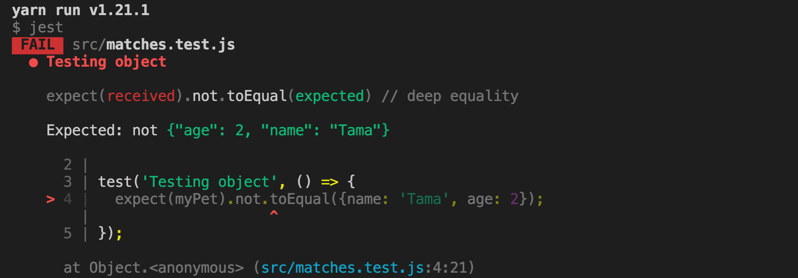

# Jestの基本シンタックス

前回のレッスンでは、Jestを使ったテスト開発環境のセットアップ方法を学習しました。

このレッスンでは、いよいよ実際にテストを書いていきます。

テストを書いていくためには、Jestの基本的なシンタックスを学習します。

## testブロック

こちらについては、前回のレッスンで学習した通りです。

## Expect関数

Jestでは、テスト対象の値やオブジェクトで予期するものが返ってきているかどうかを、expect関数でチェックします。

以下のMatchersと合わせて使用します。

 `expext()` 関数で返る値は、**expectationオブジェクト**と呼ばれるもので、返り値の設定ができます。

 `expect(4 + 4)` であれば、4 + 4を返り値として指定をすることができます。

## Matchers

テスト対象の値、もしくはオブジェクトが、期待通りの値で返ってきているかどうかを、expect関数を使って確認することを学習しました。

ただ、expect関数だけでは、最終的な値のチェックは完了しません。

どうすれば完了するかというと、expect関数の後に、**matcher**と呼ばれる関数を呼び出し、値をチェックします。

どちらもtestブロックと合わせて使用します。

基本のシンタックスは、以下です。

```javascript
test("テスト内容の説明", () => {
  expect(テスト対象の値やオブジェクト).matcher(テスト対象に期待する結果の値やオブジェクト);
});
```

ここで、前回のレッスンで使用した、sum.test.jsファイルをもう一度確認してみましょう。

```javascript
// sum.test.js

import sum from './sum';

test('1 + 2 は 3と等しい', () => {
  expect(sum(1, 2)).toBe(3);
});
```

はっきりとtestブロック、expect関数、matcherが、構成も合わせて確認できましたね。

sum.test.jsでは、matcherに `.toBe()` を使用しています。

matcherには、いくつか種類がありますので、まずは `.toBe()` から見ていきましょう。

### .toBe(value)

sum.test.jsで `.toBe()` は使用しましたね。

 `.toBe()` は、指定した値と、全く同じ値が返るかどうかをテストします。

### .toEqual(value)

オブジェクトや配列の値をテストしたい場合は、 `.toEqual()` を使用します。

 `.toBe()` から由来しているメソッドですが、テストしたい対象の値がオブジェクト、もしくは配列の場合は、 `.toEqual()` を使用することが推奨されています。

```javascript
// matcher.js

let myPet = {name: 'Tama'};
myPet = {name: 'Tama', age: 2};

export default myPet;
```

```javascript
// matcher.test.js

import myPet from './matchers';

test('Testing object', () => {
  expect(myPet).toEqual({name: 'Tama', age: 2});
});
```

### .not.matchers(value)

 `.toEqual()` や `.toBe()` は、期待した値と、等しくなる値のテストを行いますが、 `.not` を直前に付与することで、**期待した値と等しくならないかどうか**をテストすることができます。

先ほどの `.toEqual()` の例を `.not` を付与してテストを実行してみます。

```javascript
// matcher.js

let myPet = {name: 'Tama'};
myPet = {name: 'Tama', age: 2};

export default myPet;
```

```javascript
// matcher.test.js

import myPet from './matchers';

test('Testing object', () => {
  expect(myPet).not.toEqual({name: 'Tama', age: 2});
});
```



オブジェクトの値は、`{name: 'Tama', age: 2}` で等しいので、 `.not` がつくとテストが通らないのが確認できますね。

 `{name: 'Tama', age: 2}` と等しくないオブジェクトの値であれば、テストが通ります。

### Truthiness 真偽値(undefined, null, false)

undefinedやnull、falseといった値を、それぞれ区別しなければならない場合には、以下のmatchersを使用します。

値 | Matchers
------------ | -------------
null | .toBeNull()
undefined | .toBeUndefined()
undefinedではない場合 | .toBeDefined()
if文で値がtrueを返す場合 | .toBeTruthy()
if文で値がfalseを返す場合 | .toBeFalsy()

```javascript
// truthiness.test.js

test('null', () => {
  const n = null;
  expect(n).toBeNull();// nullと等しい
  expect(n).toBeDefined();// undefinedではないので正しい
  expect(n).not.toBeUndefined();// undefinedではないので正しい
  expect(n).not.toBeTruthy();// nullは条件分岐でtrueを返さないので正しい
  expect(n).toBeFalsy();// nullは条件分岐でfalseを返すので正しい
});

test('zero', () => {
  const z = 0;
  expect(z).not.toBeNull();// nullではないので正しい
  expect(z).toBeDefined();// undefinedではないので正しい
  expect(z).not.toBeUndefined();// undefinedではないので正しい
  expect(z).not.toBeTruthy();// 数値の0はは条件分岐でtrueを返さないので正しい
  expect(z).toBeFalsy();// 数値の0は条件分岐でfalseを返すので正しい
});
```

### 数値

数値をテストするmatchersには、いくつか種類があります。

テスト目的 | Matchers
------------ | -------------
〜〜より大きい | .toBeGreaterThan()
〜〜より大きい、もしくは等しい | .toBeGreaterThanOrEqual()
〜〜より小さい | .toBeLessThan()
〜〜より小さい、もしくは等しい | .toBeLessThanOrEqual()


💡 先ほど学習をした `.toBe()` と `.toEqual()` も数値には使用できます。
